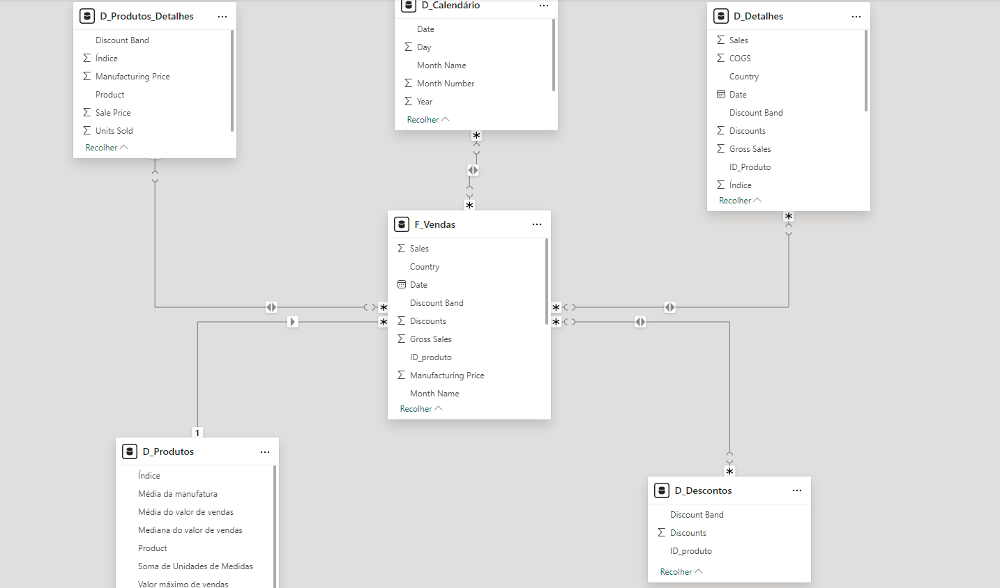

# Dashboard de E-commerce no Power BI

## Descrição do Projeto

Este projeto apresenta um **Dashboard de E-commerce** desenvolvido no Power BI, com foco em **Vendas Totais**, **Desempenho de Produtos** e **Descontos**. O objetivo principal é fornecer uma análise completa do desempenho de vendas, tendências de produtos e impacto dos descontos nas vendas.

Você pode acessar o dashboard diretamente no Power BI através deste [link](https://app.powerbi.com/links/-FBLlRPV59?ctid=da49a844-e2e3-40af-86a6-c3819d704f49&pbi_source=linkShare).

## Modelagem de Dados

A modelagem de dados seguiu o padrão **Star Schema (Esquema Estrela)**, com a tabela fato central de **F_Vendas** conectada às tabelas dimensão de **D_Calendário**, **D_Descontos**, **D_Produtos**, **D_Produtos_Detalhes** e **D_Detalhes**. A imagem abaixo ilustra a modelagem realizada, mostrando as relações entre as tabelas e os campos chave que permitem a navegação pelos dados.

- **F_Vendas**: Contém as transações de vendas, com informações como `Sales`, `Profit`, `Units Sold`, `Date`, `Country`, e `Discount Band`.
- **D_Calendário**: Tabela de calendário gerada por DAX para fornecer suporte às análises temporais, como `Year`, `Month Name`, e `Date`.
- **D_Descontos**: Inclui informações sobre as faixas de desconto aplicadas aos produtos.
- **D_Produtos**: Armazena dados gerais sobre os produtos, como `Product Name`, `Valor Máximo de Vendas`, e `Média do Valor de Vendas`.
- **D_Produtos_Detalhes**: Detalha informações sobre os produtos, como `Sale Price`, `Manufacturing Price`, e `Units Sold`.

### Visualizações no Dashboard

O dashboard está dividido em três relatórios principais:

### 1. **Relatório de Vendas Totais**
   - **Gráfico de Linhas**: Exibe as vendas totais ao longo do tempo (mês a mês), permitindo uma visualização clara das tendências de vendas.
   - **Cartões**: Apresentam KPIs importantes como **Total de Vendas**, **Total de Lucro** e **Unidades Vendidas**.
   - **Gráfico de Barras**: Mostra a contribuição de cada categoria de produto para as vendas totais.

### 2. **Relatório de Desempenho de Produtos**
   - **Tabela de Detalhes**: Mostra os principais produtos vendidos, com métricas como **Preço de Venda**, **Lucro**, e **Unidades Vendidas**.
   - **Gráfico de Pizza**: Exibe a participação de cada produto nas vendas totais, facilitando a identificação dos produtos de melhor desempenho.

### 3. **Relatório de Descontos**
   - **Gráfico de Barras**: Apresenta o total de vendas por faixa de desconto, permitindo a análise do impacto dos descontos no volume de vendas.
   - **Tabela de Resumo**: Resume os resultados das vendas com descontos, incluindo **Faixa de Desconto**, **Total de Vendas**, e **Total de Lucro**.

## Ferramentas e Técnicas Utilizadas

- **Power BI**: Ferramenta de visualização de dados para criar o dashboard interativo.
- **DAX (Data Analysis Expressions)**: Utilizado para criar cálculos e medidas customizadas, como médias e totais de vendas, além da criação de tabelas de calendário.
- **Modelagem de Dados**: Estruturada com base no **Star Schema** para otimizar a consulta e análise dos dados.

## Como Usar

1. Acesse o dashboard no Power BI usando o [link](https://app.powerbi.com/links/-FBLlRPV59?ctid=da49a844-e2e3-40af-86a6-c3819d704f49&pbi_source=linkShare).
2. Utilize os filtros interativos e gráficos para explorar os dados e obter insights sobre o desempenho das vendas e o impacto de descontos.

## Conclusão

Este dashboard de E-commerce oferece uma visão abrangente sobre o desempenho das vendas, eficácia dos descontos e popularidade dos produtos. A modelagem de dados e a utilização de visualizações dinâmicas no Power BI tornam este projeto uma ferramenta poderosa para análise e tomada de decisões.
